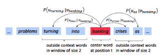
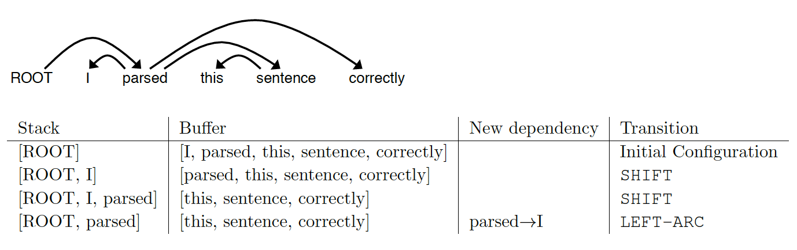
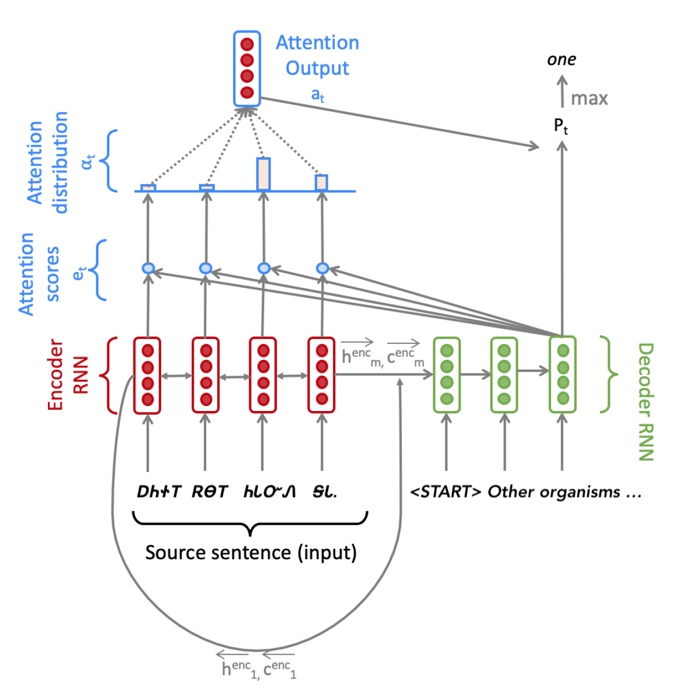

# CS 224N: Natural Language Processing with Deep Learning
This repo summarizes Assignments of [CS 224N (Stanford class on NLP - 2021)](http://web.stanford.edu/class/cs224n/). A brief summary of key concepts covered in 
different assignments is summarized below.

## Assignment 1: [Exploring Word Vectors](assignment_1/exploring_word_vectors.ipynb)
This assignment focuses in two fundamental concepts in NLP:
1. Generating count-based word vectors: Many word vector implementations are driven by the idea that similar words, i.e., (near) synonyms, will be used in similar contexts. As a result, similar words will often be spoken or written along with a shared subset of words, i.e., contexts. By examining these contexts, we can try to develop embeddings for our words. With this intuition in mind, many "old school" approaches to constructing word vectors relied on word counts. Goal of this assignment to generate word embeddings based on co-occurance
counts of words in a given corpus and reducing its dimension by performing Singular Value Decomposition (SVD).

2. Prediction-Based Word Vectors: Prediction-based word vectors have demonstrated better performance, such as word2vec and GloVe (which also utilizes the benefit of counts). This assignment explore the embeddings produced by GloVe. 200 dimensional GloVe
word vectors are imported by using Gensim library and they are reduced to 2 dimensional vectors by performing SVD for ease of visualization. Different similarity tasks are performed in order to develop an understanding of the word embedding. 

## Assignment 2: [word2vec](assignment_2/a2.pdf)
This assignment focuses on understanding and implementing the word2vec-skip gram algorithm. The goal of the skip-gram `word2vec` algorithm is to accurately learn the probability distribution P(O|C).
Given a specific word *o* and a specific word *c*, we want to calculate P(O = *o*|C = *c*), which is the probability
that word *o* is an outside word for *c*, i.e., the probability that o falls within the contextual window of *c*.

 

- In the first part of the assignment, an understanding is developed on the internal functioning of `word2vec` algorithm.
Partial derivatives are derived of the loss function considering the *naive-softmax* and *negative sampling* formulations. 
*Negative sampling* implementation is known to be much faster implementation of the algorithm in comparison to *naive-softmax*.
- In the second part of the assignment, the loss functions and their gradients are implemented. Also the stochastic gradient
descent optimizer is implemented in order the optimize the loss functions. Finally, the implementation is evaluated by
training on the Stanford Sentiment Treebank (SST) dataset.

## Assignment 3: [Dependency Parsing](assignment_3/a3.pdf)
This assignment focuses on building a neural dependency parser using PyTorch. This is the first assignment in the course
 providing hands on model development experiene using PyTorch. A separate tutorial is provided in order to understand fundamentals
 of PyTorch.
 - The first part of the assignment aims on developing understanding of Adam optimizer and use of Dropout as a regularization
 technique. 
 - The second part of the assignment focuses on implementing a neural transition-based dependency parser. 
 A dependency parser analyzes the grammatical structure of a sentence, establishing relationships between
*head* words, and words which modify those heads. There are multiple types of dependency parsers,
including transition-based parsers, graph-based parsers, and feature-based parsers. This assignment implements a 
transition-based parser, which incrementally builds up a parse one step at a time. At every step, the model maintains three
lists:

    - `stack`: Words that are currently being processed.
    - `buffer`: Words yet to be processed.
    - `dependencies`: Dependencies predicted by the parser.

    The model calculates the feature vector based on the embeddings of the top few words in `stack`, `buffer`
    , and `dependencies`, and performs a transition by selecting one of the three actions: [`shift`, 
    `left-arc`, and `right-arc`]. Please refer to the assignment description and class notes for a detailed
    explanation of the three actions. The transitions are performed till no words are left in `buffer` and `stack`.
    Evaluation of the model is finally performed based on *Unlabeled Attachment Score* (UAS), which
    is computed as the ratio between number of correctly predicted dependencies and the number of
    total dependencies despite of the relations

 

## Assignment 4: [Neural Machine Translation](assignment_4/a4.pdf)
This assignment is split into two sections: *Neural Machine Translation (NMT) with RNNs* and *Analyzing NMT
Systems*. The first is primarily coding and implementation focused, whereas the second entirely consists of
written, analysis questions.
- Part 1, Neural Machine Translation with RNNs: As a part of this exercise, a sequence-to-sequence (Seq2Seq) network with 
attention is implemented to build a NMT system. The network architecture is based on a Bidirectional LSTM Encoder and a
Unidirectional LSTM Decoder with multiplicative cross-attention between Decoder and Encoder. The goal of the system is to 
translate sentences from Cherokee to English.

 

- Part 2, Analyzing NMT Systems: This part of the assignment is focused on developing understanding and hand calculating
 BLUE score for NMT evaluation, understanding reasons why NMT systems can make an error, among other topics.